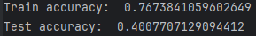
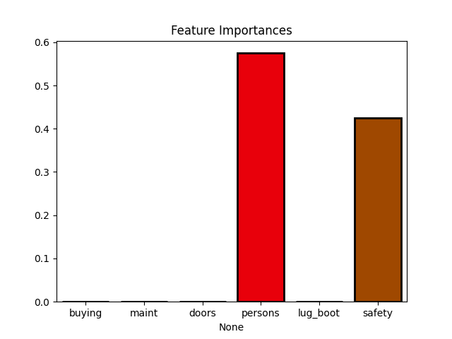
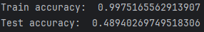
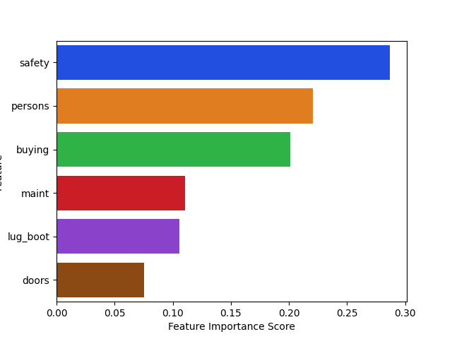
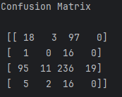
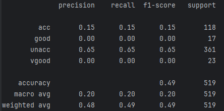
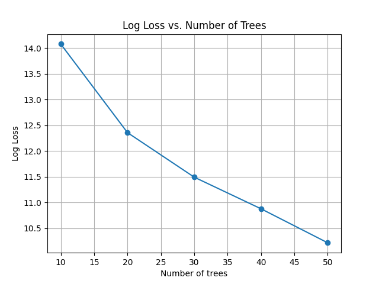

# Car Evaluation with Decision Trees and Random Forests

The Car Evaluation Database is a valuable resource for testing constructive induction and structure discovery methods. We will start by loading and exploring the dataset, which includes 1728 instances and six attributes. The 'class' attribute represents the car's evaluation (unacceptable, acceptable, good, or very good). We will preprocess the data, encode the categorical features, and split it into training and testing sets. Next, we will build classification models using decision trees and random forests to predict car acceptability. The accuracy of these models will be evaluated, and we will analyze the importance of each feature in the prediction. Finally, we will tune the number of trees in the random forest and measure its impact on the log loss.

## Table of Contents

- [Introduction](#intro)
- [Import Libraries and Load Data](#import)
- [Data Exploration](#exp)
- [Data Preprocessing](#pre)
- [Decision Tree Model](#tree)
- [Feature Importance with Decision Trees](#importances)
- [Random Forest Model](#rf)
- [Feature Importance with Random Forest](#score)
- [Confusion Matrix and Classification Report](#matrix)
- [Log Loss vs. Number of Trees](#loss)

## [Introduction](#intro)

In this project, we will explore the "Car Evaluation Database," which contains information about car acceptability based on different attributes. We will use decision trees and random forests to build a classification model that can predict whether a car's evaluation is acceptable or not. This project aims to demonstrate the use of machine learning algorithms to assess the acceptability of cars based on various features such as buying price, maintenance cost, number of doors, passenger capacity, luggage boot size, and safety.

## [Import Libraries and Load Data](#import)

We begin by importing the necessary Python libraries, such as pandas, seaborn, and scikit-learn. We load the Car Evaluation Database from a CSV file into a pandas DataFrame.

```python
import pandas as pd
import seaborn as sns
import matplotlib.pyplot as plt
from sklearn.model_selection import train_test_split
from sklearn.tree import DecisionTreeClassifier
from sklearn.metrics import accuracy_score, confusion_matrix, classification_report, log_loss
from sklearn.ensemble import RandomForestClassifier


path = r'..\car_evaluation.csv'
df = pd.read_csv(path)
```

## [Data Exploration](#exp)

We display the first five rows of the dataset, get summary statistics, and check for missing values. We also rename the columns for clarity.

```python
df.head(5)
df.describe()
df.info()
df.columns = ['buying', 'maint', 'doors', 'persons', 'lug_boot', 'safety', 'class']
```

## [Data Preprocessing](#pre)

We inspect the class distribution and encode the categorical features using ordinal encoding. The dataset is then split into training and testing sets.
Most machine learning algorithms, including decision trees and random forests, require numerical input data. Categorical features such as 'buying,' 'maint,' 'doors,' 'persons,' 'lug_boot,' and 'safety' in this dataset cannot be directly used as they are. By encoding these categorical features into numerical values, we make the data compatible with these algorithms.
Ordinal encoding is particularly suitable when there is an inherent order or hierarchy within the categories. For example, in 'buying' and 'maint,' categories like 'v-high,' 'high,' 'med,' and 'low' represent different levels of price, which have an order. Similarly, 'doors' and 'persons' have an increasing number of doors and passenger capacity, respectively. Ordinal encoding preserves this order.
If we used one-hot encoding instead of ordinal encoding, each category within a feature would be represented by a binary column (0 or 1). However, this may not capture the ordinal nature of some features. Ordinal encoding, on the other hand, assigns numerical values to categories in a way that retains the information about their relative order.

By using ordinal encoding in this project, we ensure that the machine learning models can effectively utilize the information from the categorical features while respecting the ordinal relationships between their values.

```python
encoder = ce.OrdinalEncoder(cols=['buying', 'maint', 'doors', 'persons', 'lug_boot', 'safety'])
X_train = encoder.fit_transform(X_train)
X_test = encoder.fit_transform(X_test)

X_train, X_test, y_train, y_test = train_test_split(X, y, test_size=0.3, random_state=42)
```

## [Decision Tree Model](#tree)

We build a decision tree classifier and evaluate its performance on the training and testing data.

```python
tree = DecisionTreeClassifier(max_depth=2, random_state=0)
tree.fit(X_train, y_train)

y_train_prediction_tree = tree.predict(X_train)
y_test_prediction_tree = tree.predict(X_test)

train_accuracy_tree = accuracy_score(y_train, y_train_prediction_tree)
test_accuracy_tree = accuracy_score(y_test, y_test_prediction_tree)

print('Train accuracy: ', train_accuracy_tree)
print('Test accuracy: ', test_accuracy_tree)
```



## [Feature Importance with Decision Trees](#importances)

We visualize the feature importances from the decision tree model.

```python
importances = tree.feature_importances_
columns = X.columns

sns.barplot(x=columns, y=importances, palette='bright', saturation=2.0, edgecolor='black', linewidth=2)
plt.title('Feature Importances')
plt.show()
```



## [Random Forest Model](#rf)

We create a random forest classifier and evaluate its accuracy on the training and testing sets.

```python
rf = RandomForestClassifier(n_estimators=10, random_state=0)
rf.fit(X_train, y_train)

y_train_prediction_rf = rf.predict(X_train)
y_test_prediction_rf = rf.predict(X_test)

train_accuracy_rf = accuracy_score(y_train, y_train_prediction_rf)
test_accuracy_rf = accuracy_score(y_test, y_test_prediction_rf)

print('Train accuracy: ', train_accuracy_rf)
print('Test accuracy: ', test_accuracy_rf)
```



## [Feature Importance with Random Forest](#score)

We visualize the feature importances from the random forest model.

```python
feature_scores = pd.Series(rf.feature_importances_, index=X_train.columns).sort values(ascending=False)

sns.barplot(x=feature_scores, y=feature_scores.index, palette='bright')
plt.xlabel('Feature Importance Score')
plt.ylabel('Feature')
plt.show()
```



## [Confusion Matrix and Classification Report](#matrix)

The confusion matrix is a table that allows us to visualize the model's performance. It shows the number of true positives (correctly predicted positive cases), true negatives (correctly predicted negative cases), false positives (actual negatives incorrectly predicted as positives), and false negatives (actual positives incorrectly predicted as negatives). The confusion matrix provides a more comprehensive view of the model's accuracy.

```python
cm = confusion_matrix(y_test, y_test_prediction_rf)
print('Confusion Matrix\n\n', cm)
```



The classification report provides a summary of various classification metrics, including precision, recall, F1-score, and support for each class. It offers a more in-depth analysis of the model's performance, especially when dealing with multiclass classification.

```python
print(classification_report(y_test, y_test_prediction_rf))
```



These two components are crucial for understanding how well our model is performing, especially in a multiclass classification scenario like the one in this project. They give us insights into the model's strengths and weaknesses in different areas, helping us make informed decisions about model improvements and adjustments.

## [Log Loss vs. Number of Trees](#loss)

We experiment with different numbers of trees in the random forest and plot the log loss to analyze the model's performance.

```python
n_estimators_list = [10, 20, 30, 40, 50]
loss_values = []

for n_estimators in n_estimators_list:
    rf = RandomForestClassifier(n_estimators=n_estimators, random_state=0)
    rf.fit(X_train, y_train)

    y_test_probabilities = rf.predict_proba(X_test)
    loss = log loss(y_test, y_test_probabilities)
    loss_values.append(loss)

plt.plot(n_estimators_list, loss_values, marker='o')
plt.xlabel(f'Number of trees')
plt.ylabel('Log Loss')
plt.title('Log Loss vs. Number of Trees')
plt.grid(True)
plt.show()
```


